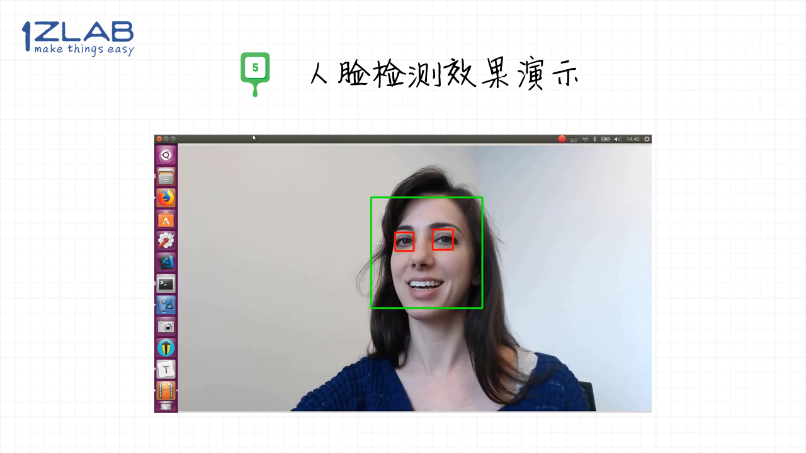

# OpenCV人脸检测-1Z实验室出品

**1zlab: Make Thing Easy**

opencv实现人脸检测， 识别视频流中人脸的位置，并且画出人脸所在的矩形区域。

## 视频教程

1Z实验室同时也出品了配套的视频教程：

[教程文稿](https://github.com/1zlab/1ZLAB_OpenCV_Tutorial/blob/master/01.%E8%AF%BE%E7%A8%8B%E5%AF%BC%E5%BC%95/02.%E4%BA%BA%E8%84%B8%E6%A3%80%E6%B5%8B/%E4%BA%BA%E8%84%B8%E6%A3%80%E6%B5%8B.md)

>不知道从什么时候开始，学习OpenCV首先学习人脸检测，变成了一个传统。
>
>在本节课，首先介绍一下人脸检测在日常生活中的广泛应用，然后讲解人脸检测与人脸识别的区别， 接下来会教大家通过OpenCV内置的人脸检测模型，实时的在画面中绘制人脸所在的位置。

## 演示效果

## 社群推广

